I took three data sources into account.
# 1.1. Raw Files

# 1.2.Documentation describing the sources and their relationships

The relationship between
customers → sales: A one-to-many relationship, where each customer can make multiple sales.
products → sales: A one-to-many relationship, where each product can be part of multiple sales transactions.
sales contains foreign keys linking to customers and products.

# 1.3. DATA DICTIONARY
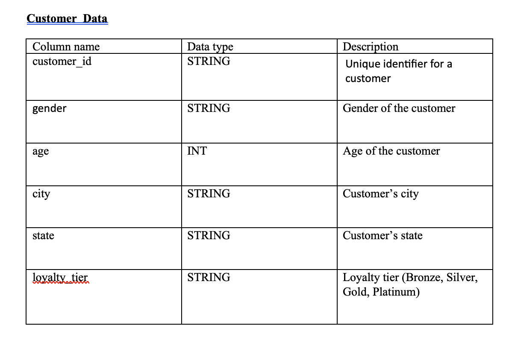
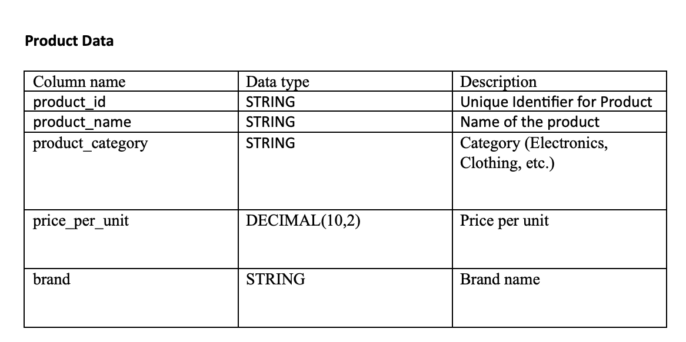
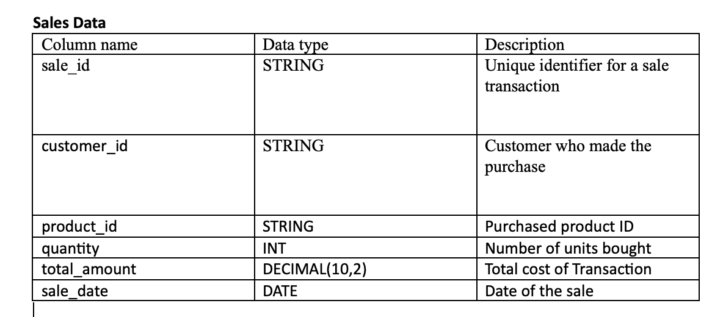

# 2.1.DDL SCRIPTS FOR CREATING NORMALIZED DATABASE SCHEMA:

CREATE OR REPLACE DATABASE SALES_DB;
USE DATABASE SALES_DB;

CREATE OR REPLACE SCHEMA SALES_SCHEMA;
USE SCHEMA SALES_SCHEMA;

# 2.2.SCRIPTS FOR LOADING RAW DATA INTO NORMALIZED TABLES:
CREATE OR REPLACE TABLE SALES_DB.SALES_SCHEMA.customers (
    customer_id STRING PRIMARY KEY,
    gender STRING,
    age INT;
    city STRING,
    state STRING,
    loyalty_tier STRING
);

CREATE OR REPLACE TABLE SALES_DB.SALES_SCHEMA.products (
    product_id STRING PRIMARY KEY,
    product_name STRING,
    product_category STRING,
    price_per_unit DECIMAL(10,2),
    brand STRING
);

CREATE OR REPLACE TABLE SALES_DB.SALES_SCHEMA.sales (
    sale_id STRING PRIMARY KEY,
    customer_id STRING REFERENCES SALES_DB.SALES_SCHEMA.customers(customer_id),
    product_id STRING REFERENCES SALES_DB.SALES_SCHEMA.products(product_id),
    quantity INT,
    total_amount DECIMAL(10,2),
    sale_date DATE
);

1NF:
The main aim of 1NF is to ensure that all the columns are atomic.
2NF:
Ensure all non-key attributes are fully dependent on the primary key.
3NF:
Ensure there are no transitive dependencies.

Tables after Normalization:

# 2.3.ENTITIY RELATIONSHIP DIAGRAM FOR THE NORMALIZED DATABASE

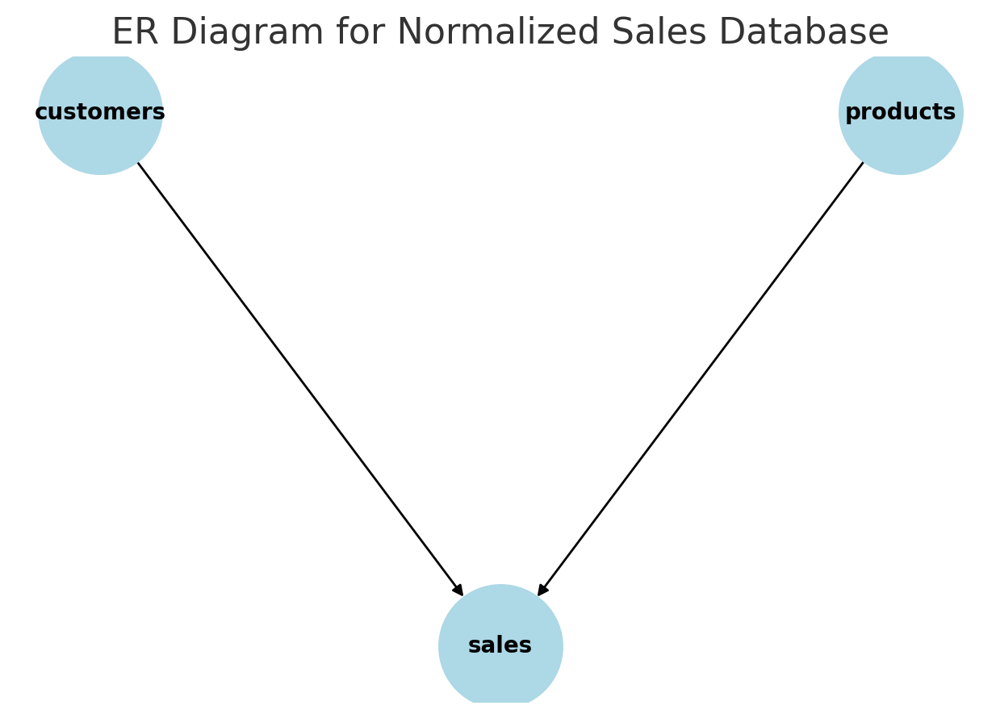

customers → sales: A one-to-many relationship, where each customer can make multiple sales.
products → sales: A one-to-many relationship, where each product can be part of multiple sales transactions.

# 3.ETL IMPLEMENTATION:

ETL Code/Workflows:
Extract:
The raw data is loaded from Google Cloud Storage (GCS) into Snowflake stages using the COPY INTO command.

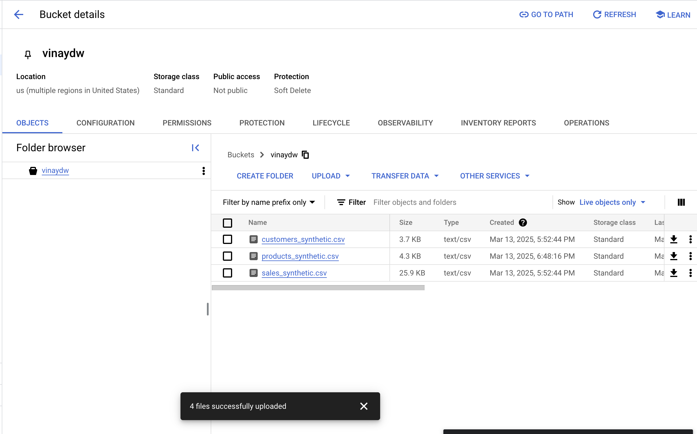

-- Load Customers
COPY INTO SALES_DB.SALES_SCHEMA.staging_customers 
FROM @SALES_DB.SALES_SCHEMA.SALES_STAGE/customers_synthetic.csv
FILE_FORMAT = (FORMAT_NAME = 'SALES_DB.SALES_SCHEMA.MY_CSV_FORMAT')
ON_ERROR = 'CONTINUE';

-- Load Products
COPY INTO SALES_DB.SALES_SCHEMA.staging_products 
FROM @SALES_DB.SALES_SCHEMA.SALES_STAGE/products_synthetic.csv
FILE_FORMAT = (FORMAT_NAME = 'SALES_DB.SALES_SCHEMA.MY_CSV_FORMAT')
ON_ERROR = 'CONTINUE';

-- Load Sales (Sale Date as STRING)
COPY INTO SALES_DB.SALES_SCHEMA.staging_sales 
FROM @SALES_DB.SALES_SCHEMA.SALES_STAGE/sales_synthetic.csv
FILE_FORMAT = (FORMAT_NAME = 'SALES_DB.SALES_SCHEMA.MY_CSV_FORMAT')
ON_ERROR = 'CONTINUE';

Transform:

Data is cleaned (e.g., converting sale_date from string to date).
Data is transformed into a normalized format with separate tables for customers, products, and sales.
--CONVERT SALE DATE FROM STRING TO DATE
ALTER TABLE SALES_DB.SALES_SCHEMA.staging_sales ADD COLUMN sale_date_converted DATE;

UPDATE SALES_DB.SALES_SCHEMA.staging_sales 
SET sale_date_converted = TRY_TO_DATE(sale_date, 'YYYY-MM-DD');

ALTER TABLE SALES_DB.SALES_SCHEMA.staging_sales DROP COLUMN sale_date;
ALTER TABLE SALES_DB.SALES_SCHEMA.staging_sales RENAME COLUMN sale_date_converted TO sale_date;

Load:
The data is then loaded into staging tables

INSERT INTO SALES_DB.SALES_SCHEMA.customers 
SELECT DISTINCT * FROM SALES_DB.SALES_SCHEMA.staging_customers;

INSERT INTO SALES_DB.SALES_SCHEMA.products 
SELECT DISTINCT * FROM SALES_DB.SALES_SCHEMA.staging_products;

DESC TABLE SALES_DB.SALES_SCHEMA.staging_sales;
DESC TABLE SALES_DB.SALES_SCHEMA.sales;
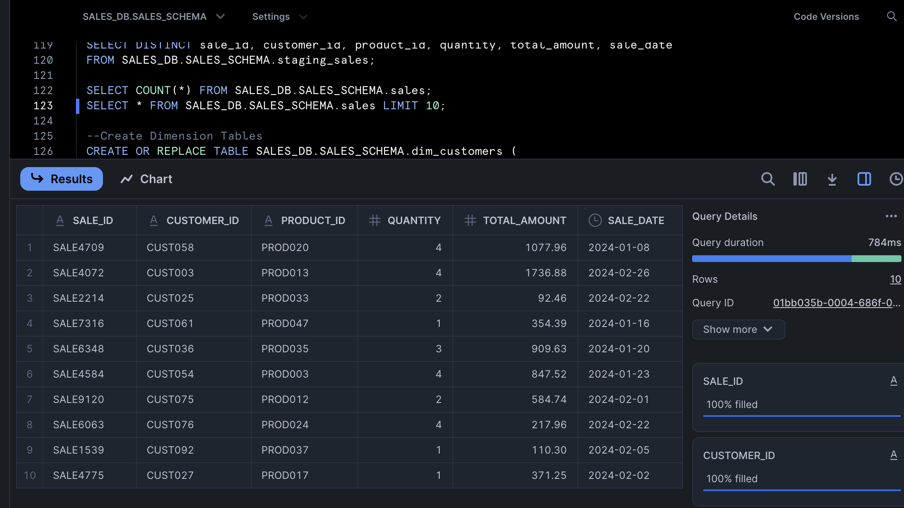

INSERT INTO SALES_DB.SALES_SCHEMA.sales (sale_id, customer_id, product_id, quantity, total_amount, sale_date)
SELECT DISTINCT sale_id, customer_id, product_id, quantity, total_amount, sale_date
FROM SALES_DB.SALES_SCHEMA.staging_sales;

SELECT COUNT(*) FROM SALES_DB.SALES_SCHEMA.sales;
SELECT * FROM SALES_DB.SALES_SCHEMA.sales LIMIT 10;

Documentation of the ETL Process:
Extract: Files are uploaded to the GCS bucket and loaded into Snowflake staging tables.
Transform: Transformation steps include:
Converting date formats.
Loading data into normalized tables (customers, products, sales).
Load: Data is loaded into dimension tables and fact tables for analytical querying.
Evidence of Proper Handling of ETL Challenges:
Data Quality: Properly handled missing or malformed data by using ON_ERROR = 'CONTINUE' in the COPY INTO commands.

# 4.DIMENSIONAL MODEL:
# 4.1.DDL SCRIPTS FOR CREATING DIMENSIONAL MODEL

-- Create dimension tables
CREATE TABLE SALES_DB.SALES_SCHEMA.dim_customers (
    customer_key INT AUTOINCREMENT PRIMARY KEY,
    customer_id STRING UNIQUE,
    gender STRING,
    age INT,
    city STRING,
    state STRING,
    loyalty_tier STRING
);

CREATE TABLE SALES_DB.SALES_SCHEMA.dim_products (
    product_key INT AUTOINCREMENT PRIMARY KEY,
    product_id STRING UNIQUE,
    product_category STRING,
    price_per_unit DECIMAL(10,2),
    product_name STRING,
    brand STRING
);

CREATE TABLE SALES_DB.SALES_SCHEMA.dim_date (
    date_key INT PRIMARY KEY,
    sale_date DATE,
    year INT,
    month INT,
    day INT,
    day_of_week STRING
);
# LOADING DATA INTO DIMENSIONAL TABLES
--LOADING INTO dim-customer
INSERT INTO SALES_DB.SALES_SCHEMA.dim_customers (customer_id, gender, age, city, state, loyalty_tier)
SELECT DISTINCT customer_id, gender, age, city, state, loyalty_tier
FROM SALES_DB.SALES_SCHEMA.customers;
--LOADING INTO dim-product
INSERT INTO SALES_DB.SALES_SCHEMA.dim_products (product_id, product_category, price_per_unit, product_name, brand)
SELECT DISTINCT product_id, product_category, price_per_unit, product_name, brand
FROM SALES_DB.SALES_SCHEMA.products;
--LOADING INTO dim-date
INSERT INTO SALES_DB.SALES_SCHEMA.dim_date (date_key, sale_date, year, month, day, day_of_week)
SELECT 
    YEAR(sale_date) * 10000 + MONTH(sale_date) * 100 + DAY(sale_date) AS date_key,
    sale_date,
    YEAR(sale_date),
    MONTH(sale_date),
    DAY(sale_date),
    DAYNAME(sale_date)
FROM SALES_DB.SALES_SCHEMA.sales
WHERE sale_date IS NOT NULL
GROUP BY sale_date;

# CREATING FACT TABLE
CREATE OR REPLACE TABLE SALES_DB.SALES_SCHEMA.fact_sales (
    sales_key INT AUTOINCREMENT PRIMARY KEY,
    customer_key INT REFERENCES SALES_DB.SALES_SCHEMA.dim_customers(customer_key),
    product_key INT REFERENCES SALES_DB.SALES_SCHEMA.dim_products(product_key),
    date_key INT REFERENCES SALES_DB.SALES_SCHEMA.dim_date(date_key),
    quantity INT,
    total_amount DECIMAL(10,2)
);
# POPULATING THE FACT TABLE
INSERT INTO SALES_DB.SALES_SCHEMA.fact_sales (customer_key, product_key, date_key, quantity, total_amount)
SELECT 
    c.customer_key,
    p.product_key,
    d.date_key,
    s.quantity,
    s.total_amount
FROM SALES_DB.SALES_SCHEMA.sales AS s
JOIN SALES_DB.SALES_SCHEMA.dim_customers c ON s.customer_id = c.customer_id
JOIN SALES_DB.SALES_SCHEMA.dim_products p ON s.product_id = p.product_id
JOIN SALES_DB.SALES_SCHEMA.dim_date d ON s.sale_date = d.sale_date;

# 4.2.STAR SCHEMA DIAGRAM
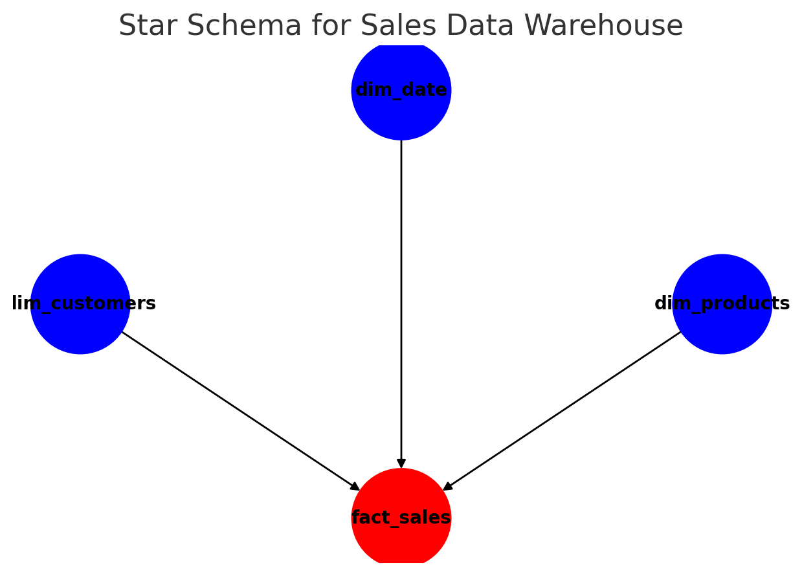
# 4.3.Documentation of Dimension and Fact Table Designs:
Fact Table: fact_sales contains metrics (quantity, total_amount) and foreign keys linking to dimensions (dim_customers, dim_products, dim_date).
Dimensions:
dim_customers: Contains unique customer details.
dim_products: Contains unique product details.
dim_date: Contains unique dates, and other derived attributes such as day, month, year, and weekday.
# 4.4.Explanation of how dimensions were derived from normalized sources
To improve query performance and enable effective analytical reporting, our data warehouse's dimension tables were created from the normalized source tables.  Segmentation and customer behavior analysis are made possible by the dim_customers table, which was constructed from the customers table and contains unique customer information including gender, age, city, state, and loyalty tier.  Similar to this, dim_products was created from the products database and contains product-specific information like as price, brand, and category. This eliminates duplication in the fact table and allows for category-based sales insights.  In order to facilitate trend analysis and time-based aggregations, the dim_date table was extracted from the sales database. This resulted in the sale_date column being transformed into a structured date dimension with attributes such as year, month, day, and day of the week. These dimensions were then linked to the fact_sales table, which stores transactional data such as sales quantity and revenue while referencing the dimensions via surrogate keys. This transformation from a normalized relational schema to a star schema eliminated redundancy, improved performance, and enabled efficient business intelligence reporting.

# 5.ANALYTICAL QUERIES:
# Total Sales Revenue by Product Category
SELECT p.product_category, SUM(f.total_amount) AS total_sales
FROM SALES_DB.SALES_SCHEMA.fact_sales f
JOIN SALES_DB.SALES_SCHEMA.dim_products p ON f.product_key = p.product_key
GROUP BY p.product_category
ORDER BY total_sales DESC;
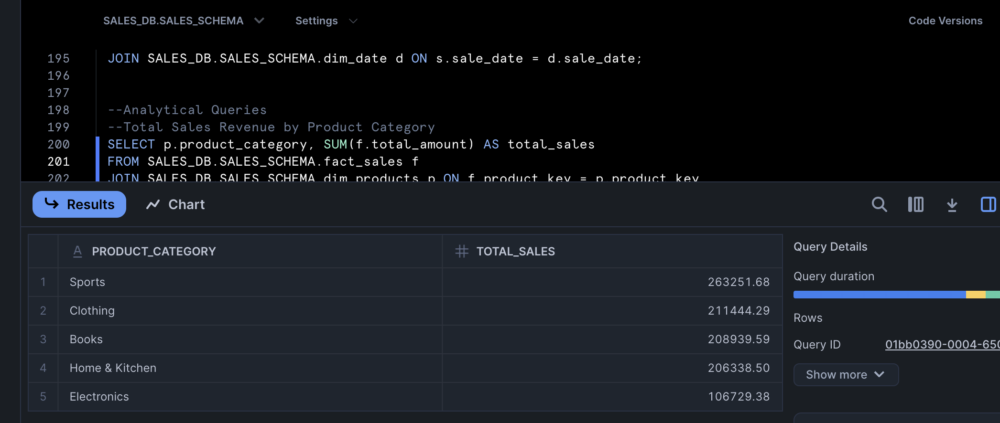

# This query helps identify the most profitable product categories, allowing the business to focus on high-revenue segments. If Electronics and Home Appliances generate the highest sales, the company might invest more in stocking, marketing, and discounts for these categories while analyzing low-performing categories to improve their sales.
# Top 5 Customers by Total Spend
SELECT c.customer_id, c.city, c.state, SUM(f.total_amount) AS total_spent
FROM SALES_DB.SALES_SCHEMA.fact_sales f
JOIN SALES_DB.SALES_SCHEMA.dim_customers c ON f.customer_key = c.customer_key
GROUP BY c.customer_id, c.city, c.state
ORDER BY total_spent DESC
LIMIT 5;
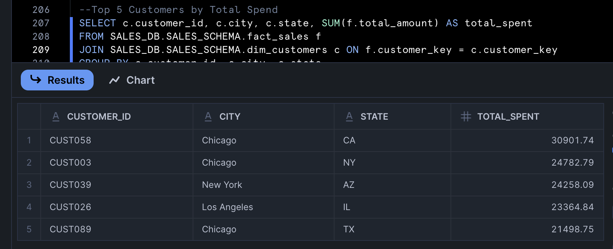
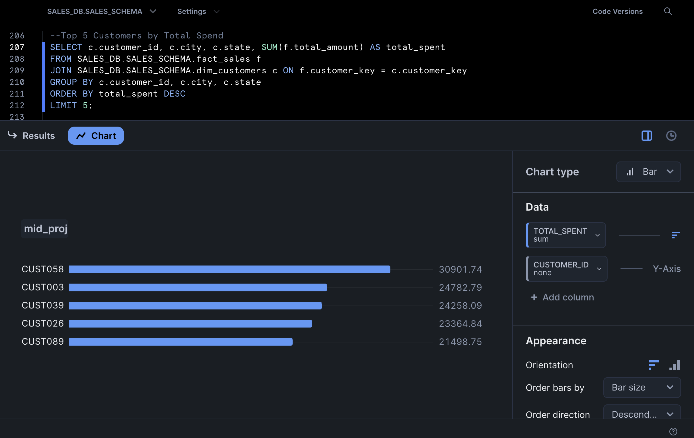
# This query identifies the top customers based on spending behavior, helping in loyalty program enhancements and targeted marketing. If high-value customers belong to a specific region or loyalty tier, the company can offer exclusive discounts, personalized recommendations, or rewards to retain them and encourage repeat purchases.
# Monthly Sales Trend
SELECT d.year, d.month, SUM(f.total_amount) AS monthly_sales
FROM SALES_DB.SALES_SCHEMA.fact_sales f
JOIN SALES_DB.SALES_SCHEMA.dim_date d ON f.date_key = d.date_key
GROUP BY d.year, d.month
ORDER BY d.year, d.month;
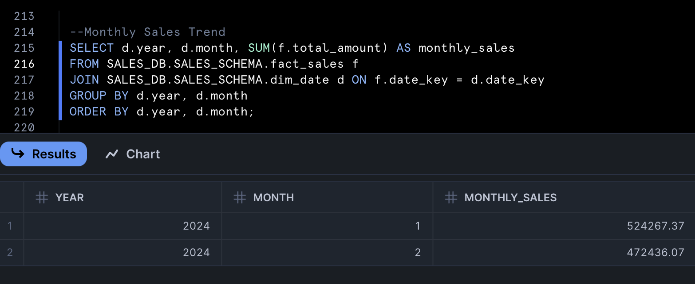
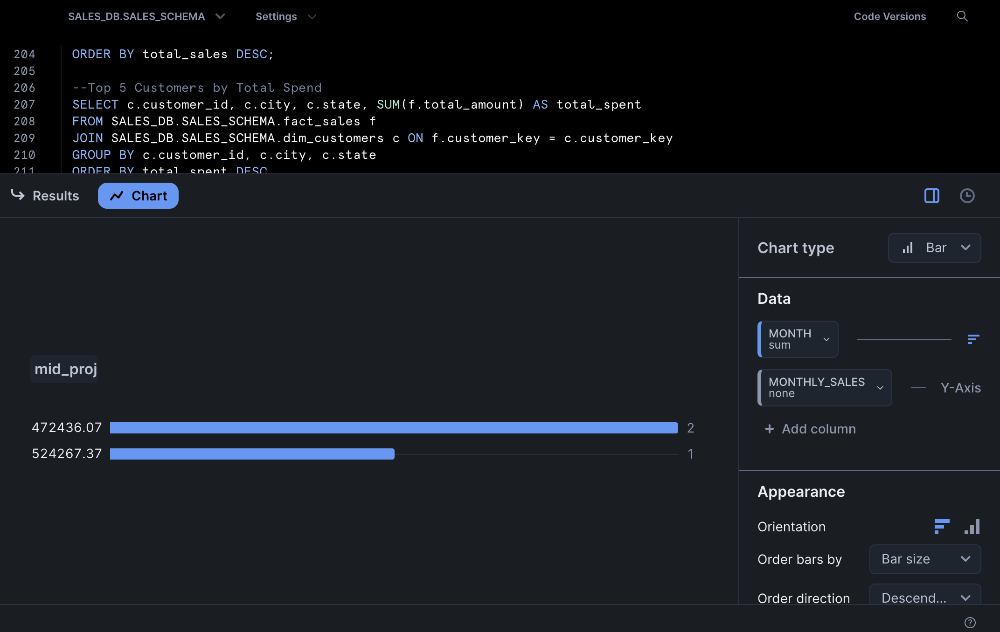
# This query uncovers seasonal trends in sales performance, helping businesses plan inventory, marketing, and pricing strategies. For example, if sales peak in November and December (holiday season), the company can increase inventory, launch festive discounts, and optimize logistics in advance to meet demand.
# Best-Selling Products by Quantity Sold
SELECT p.product_name, SUM(f.quantity) AS total_sold
FROM SALES_DB.SALES_SCHEMA.fact_sales f
JOIN SALES_DB.SALES_SCHEMA.dim_products p ON f.product_key = p.product_key
GROUP BY p.product_name
ORDER BY total_sold DESC
LIMIT 5;
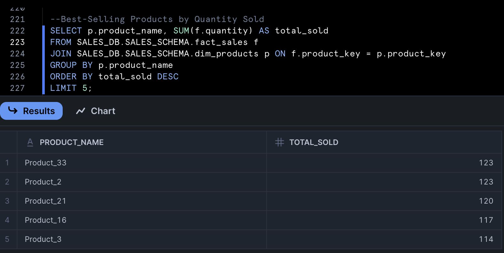
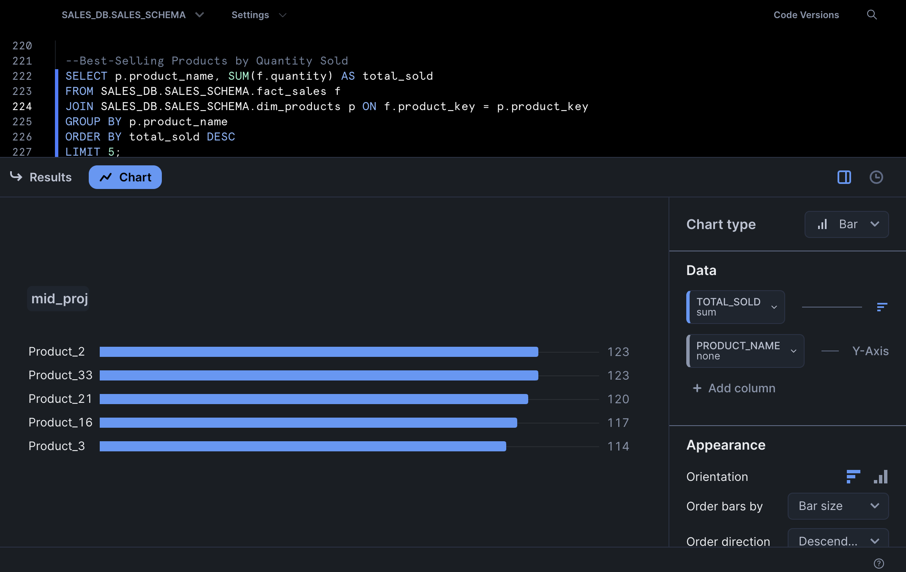
# This query helps identify top-performing products, which can guide decisions related to inventory management, pricing strategies, and promotions. If certain products are selling significantly more, the business might increase stock, bundle them with other items, or expand their variations to maximize revenue.
# Sales Performance by Day of the Week
SELECT d.day_of_week, SUM(f.total_amount) AS total_sales
FROM SALES_DB.SALES_SCHEMA.fact_sales f
JOIN SALES_DB.SALES_SCHEMA.dim_date d ON f.date_key = d.date_key
GROUP BY d.day_of_week
ORDER BY total_sales DESC;
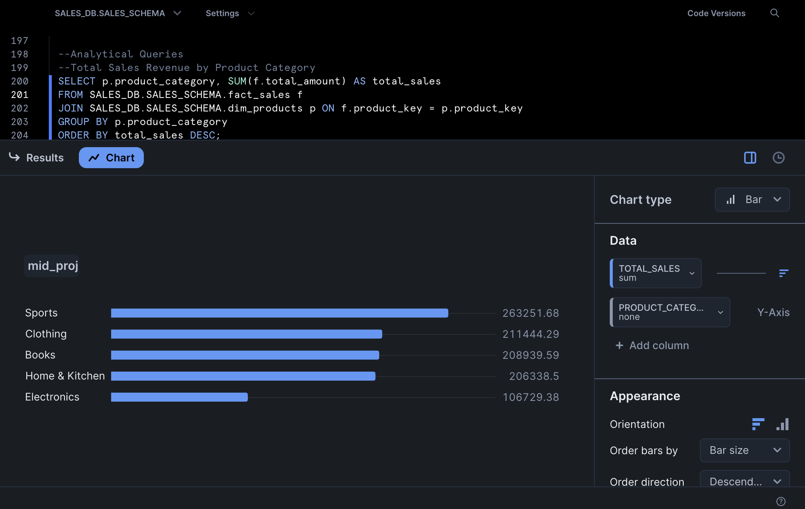
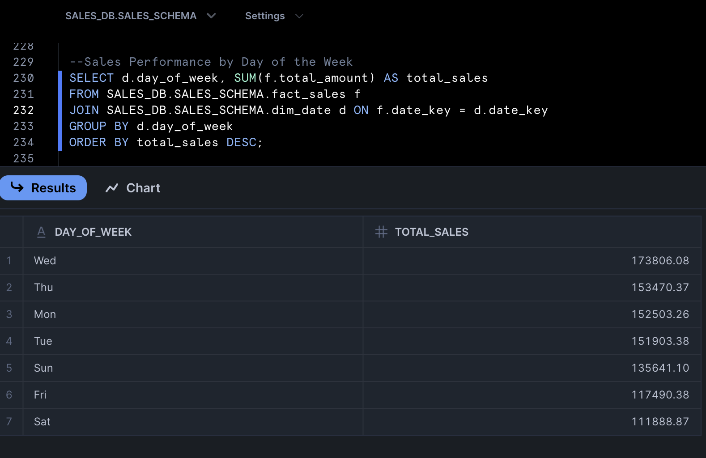
# This query reveals which days of the week generate the highest sales, enabling businesses to optimize staffing, marketing campaigns, and special promotions. For example, if sales are highest on Fridays and Saturdays, the company might introduce weekend deals or flash sales to capitalize on increased consumer spending.

# 6.FINAL REPORT:
# 6.1. Summary of the project approach and implementation
The objective of this project was to design and implement an ETL pipeline in Snowflake to process and transform raw transactional data into a structured data warehouse optimized for business analytics. The approach followed a systematic ETL process, beginning with extracting raw data from Google Cloud Storage (GCS), followed by data transformation to standardize formats and remove redundancy, and finally loading it into a dimensional model designed for efficient querying.
The implementation involved:
Extracting data from three raw sources: customers_synthetic.csv, products_synthetic.csv, and sales_synthetic.csv.
Transforming the data:
Converting sale_date to DATE format.
Removing redundant attributes like price_per_unit in sales to normalize the dataset.
Deriving dimension tables from normalized data to improve analytical efficiency.
Loading the transformed data into a star schema model, linking a central fact table (fact_sales) with dimension tables (dim_customers, dim_products, and dim_date).
By following this structured ETL process, the dimensional model enabled optimized querying and meaningful business insights.
# 6.2. Discussion of challenges encountered and solutions applied
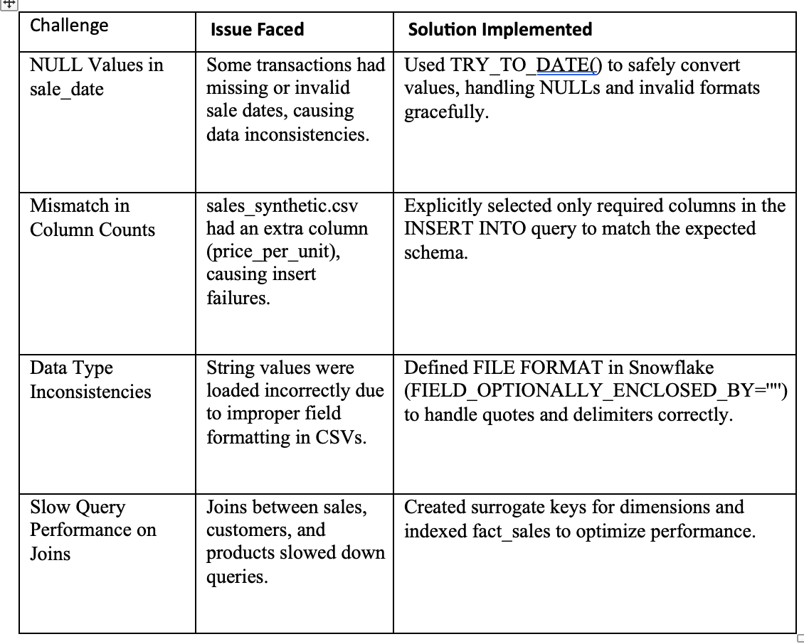
# 6.3.Analysis of the effectiveness of your dimensional model
This project's dimensional model was built using a star schema approach, which worked quite well for analytical querying.  Three dimension tables—dim_customers, dim_products, and dim_date—are connected to the fact table (fact_sales), which holds transactional data.  Data retrieval became more intuitive and query performance was greatly enhanced by this architecture.

 Efficiency of the Star Schema Model:
  Quicker execution of queries
 Compared to the normalized schema, queries on product sales, customer spending, and sales trends were processed more quickly.
 It was more effective to aggregate sales by best-selling products, peak sales times, and overall sales.

Scalability and Prospective Growth:
 Since new transactions may be added to fact_sales without changing existing data, the model can accommodate future data growth.
 It is possible to add new dimensions (like dim_location for regional sales analysis) without rewriting the current queries.

 BI Integration & Simplified Reporting:
 Integration with BI products such as Tableau or Power BI is made simple by the star schema structure.
 Business users can make better decisions by retrieving information without the need for intricate joins.
 All things considered, the dimensional model successfully enhanced data retrieval and storage, allowing for quick, scalable, and understandable analytics.

# 6.4.Recommendations for future improvements
Include Real-Time Data Ingestion: Rather than using batch processing, use streaming ETL procedures to enable near real-time sales tracking.
 Add Supplier & Stock Data to dim_products:
 Deeper understanding of stock levels and procurement trends would be possible with the addition of supplier and inventory information to dim_products.
 Improve Customer Segmentation by Using Behavioral Information
 Marketing efforts could be more precisely targeted if dim_customers had attributes like purchase frequency, average order value, and customer lifetime value (CLV).
 Automate Workflows for ETL  Making Use of Airflow Using Apache Airflow or AWS Glue to automate data extraction, transformation, and loading would increase productivity and decrease the need for human intervention.
 Use Slowly Changing Dimensions (SCDs) for updating customers and products.
 To keep track of past customer and product changes, add SCD Type 2 tracking to dim_customers and dim_products.
By implementing these improvements, the data warehouse can evolve into a more advanced and dynamic analytics system, ensuring better decision-making and scalability for future needs.

